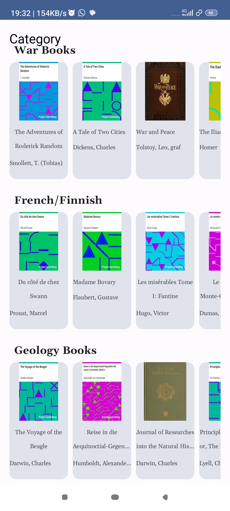
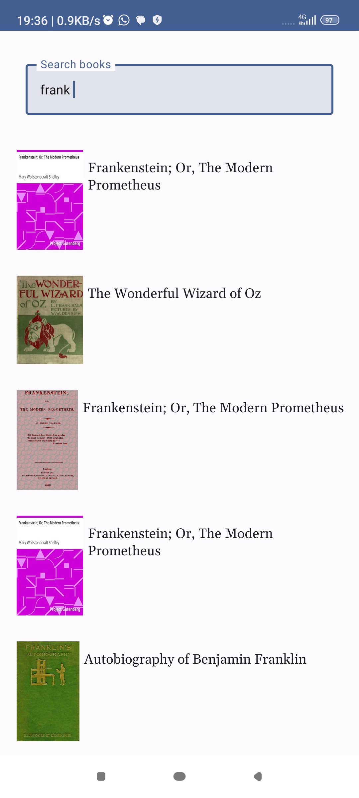
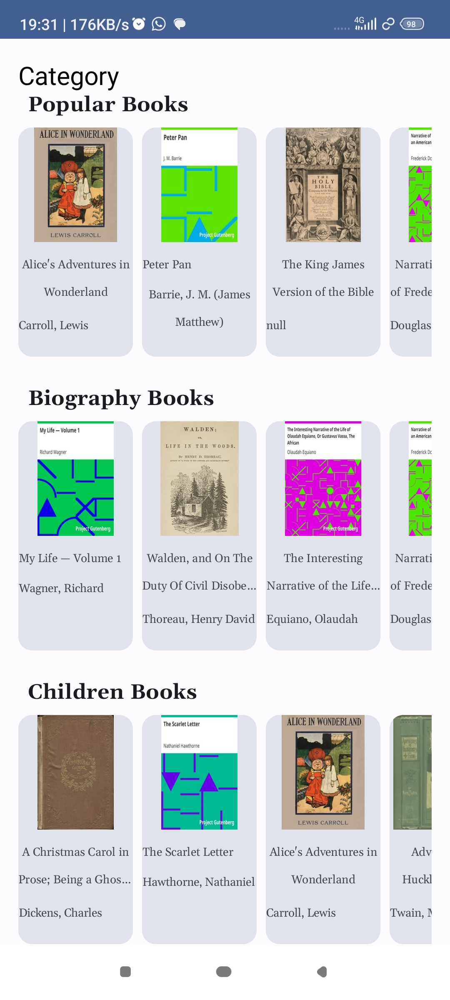

# BOOK App
 Book is an android App that allows users to search for books, view details of the book.
 The app uses room databases to store data, retrofit to make API calls, the app also uses prepopulated 
 data stored in the assets folder.

### Bugs and Issues 
Please note the app is currently under development as new features will be added and bugs may be present. Bugs report and suggestions 
are welcome.

### Language
**Language:** Kotlin 100%

### Tools Used
  * Dagger-Hilt* 
  * Coroutines*
  * MVVM*
  * Room*
  * ViewModel*
  * Jetpack Compose
  * Gson Converter
  * OkHttp

### Future Features
  * Dark Mode
  * Integrate Google Api
  * Implement Bottom sheet to contain details for the books
  * Authentication

### Contributing 
Pull request are welcomed. For major changes please open and issue first to discuss what you would like to change

### Support 
If you like the project, please consider supporting it by giving a star 

